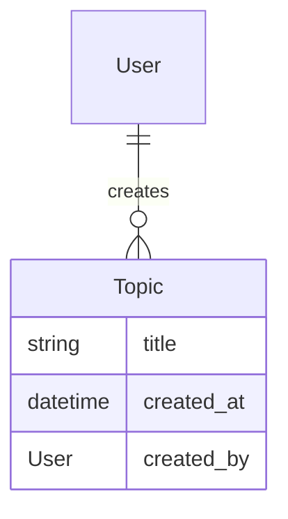
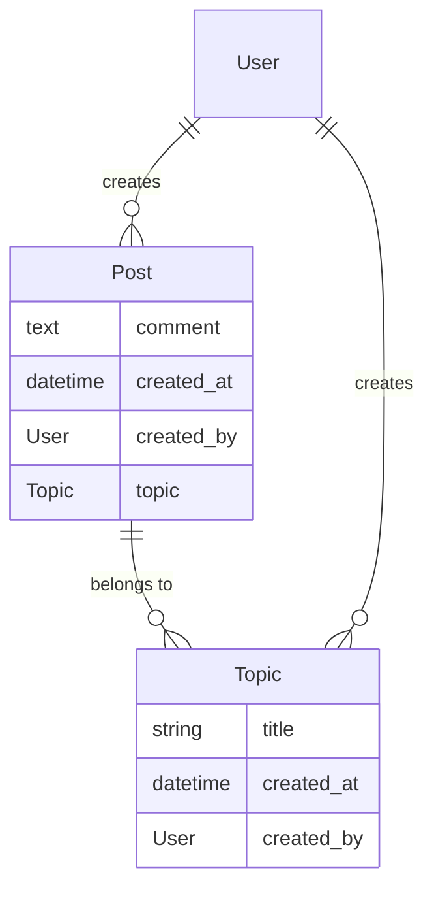
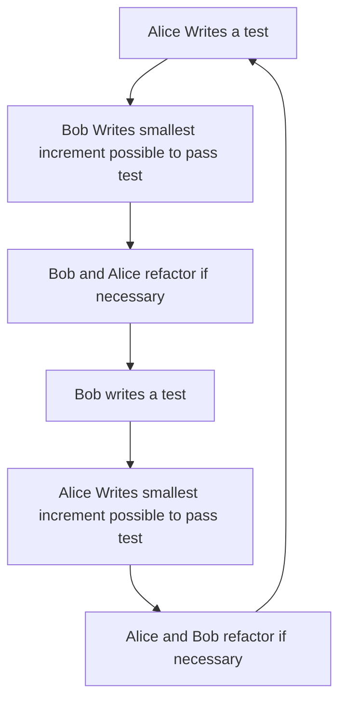

# Cohorts Template

# Session 1

## Prerequisites

* System with [git](https://git-scm.com/) installed (Tested with Mac and Windows. Should work happily on Linux). 
* A GitHub user account.
* Editor or IDE ([PyCharm](https://www.jetbrains.com/pycharm/) recommended, either professional or community) capable of working with Python files. I recommend you use the professional trial version of PyCharm, and our instructions will assume that. You will need to self-adapt the instructions if you use something different.
* [Pop](https://pop.com/) in order to pair with other members if not local.

## Setup

In GitHub, [go to the template repository for this class](https://github.com/StrongMind/cohort_template), and clone into your personal GitHub by selecting "Use This Template".

In a terminal window:
* `git clone <your repo url here> ` 
	* where "your repo url here" is the URL of the cloned repository in your account change directory to where you cloned it.

* `docker-compose build`

Open the project in PyCharm by opening the project folder inside of it.

In PyCharm preferences (file > settings on Windows) (you may need to install the docker plugin, before this is available):

* go to your project
* go to "Python interpreter"
* click the settings icon next to your interpreter
* click add
* select "Docker Compose" in the left of the dialog
* select the new button next to server
  * choose Docker for Mac/Windows

* choose "web" in service and then click "OK"

In WSL2 or a terminal:
* To get a bash prompt inside your docker environment:
  * `docker-compose run web bash`
* To start a new django project:
  * `django-admin startproject cohort`

Those two steps should have created a new project inside your repository named "cohort". In the future, when we talk about "from a docker bash prompt", you will use `docker-compose run web bash` to get there. 

In PyCharm, right click on the `cohort` folder, then Mark directory as sources root.

Finally, right click on `docker-compose.yml` and click "run docker-compose.yml". (If you decided not to use PyCharm, you would run `docker-compose up` here.)

In a browser, [go to http://localhost:8000](http://localhost:8000). You should now see a welcome page. You now have a django app successfully running.

## Create an app

A django project consists of applications. These can either be applications you create yourself, or applications installed from Python packages available on PyPI (the python package repository). Reusable applications are a quick way to get significant chunks of functionality very quickly, as we will show you later.

For now, though, let's start our first application!

From a docker bash prompt:
* `cd cohort`
* `python manage.py startapp forum` this command creates an application in the project named "forum".

In `cohort/settings.py`, you will see an `INSTALLED_APPS` section. This controls which applications a django project has installed. You can see several applications already installed that come as a standard part of django. Let's install our newly created application into this list, by adding "forum" to this list.

## Set Up Tests

This project comes set up in advance to use `pytest-describe`. From a docker bash prompt in the cohort project directory, run `pytest`. You should see similar output to this.

```console
root@f861c41270fe:/code/cohort# pytest
================================================================================ test session starts ================================================================================
platform linux -- Python 3.10.3, pytest-7.1.1, pluggy-1.0.0
rootdir: /code/cohort
plugins: Faker-13.3.2, django-4.5.2, describe-2.0.1
collected 0 items                                                                                                                                                                   

=============================================================================== no tests ran in 0.06s ===============================================================================
root@f861c41270fe:/code/cohort# 

```

## Our first model

We're going to create a discussion system. When creating a system like this, it helps to start "model out"; this way, we can already know what the APIs of our dependencies look like. Here's what our first model will look like. It will have an established relationship with a model that already exists by default in django, the user model.




### Tests

Rename the file `tests.py` to `test_topic.py`.

Create a file in your cohort project directory called `pytest.ini` that contains the following:

```ini
[pytest]
DJANGO_SETTINGS_MODULE=cohort.settings
```


If you are using PyCharm, you can automatically run tests whenever changes are made. This reduces feedback time significantly. To do this:

* Go to Run -> Edit Configurations
* Click the + in the top left of the dialog
* Choose pytest within Python tests
* Set the target to "script path" and in the path box below, select the cohort subdirectory in your project.
* Save this by pressing okay, then selecting Run -> Run pytest in cohort
* Test runs will appear at the bottom of you window; to turn on auto-test, select the icon to the left two below the green run icon.

Let's set up your first couple of tests working toward building this system.  Copy and paste the following into `test_topic.py`

```python
import factory.django
import pytest
from django.contrib.auth.models import User

from forum.models import Topic


class UserFactory(factory.django.DjangoModelFactory):
    class Meta:
        model = User

    email = factory.Faker('email')
    username = factory.Faker('user_name')


class TopicFactory(factory.django.DjangoModelFactory):
    class Meta:
        model = Topic

    title = factory.Faker('sentence')
    created_by = factory.SubFactory(UserFactory)


@pytest.mark.django_db
def describe_topic():
    def exists():
        TopicFactory()

    def saves_its_fields():
        topic = TopicFactory()

        sut = Topic.objects.get(pk=topic.id)

        assert sut.title == topic.title
        assert sut.created_by == topic.created_by

```

Now run the tests; if you're in a taught session, this is where we'll start. Otherwise, follow the errors!


## Answering the tests

In the last section, we set up a project and created a few failing tests. In this session, we're first going to answer those tests and set up a few pieces of functionality.

### Set up models

Our model looked like the following:


The tests that we have set up expect you to create a `Topic` model.  A model is a representation of a business object as a class, which in the case of most [MVC](https://developer.mozilla.org/en-US/docs/Glossary/MVC) frameworks is mapped to a database table using [an ORM](https://en.wikipedia.org/wiki/Object-relational_mapping).  

Update your two respective files to match the following linked files:
* [test_topic.py](https://gist.githubusercontent.com/markng/19f2d7861a0df0a2b4849037fe0c0e07/raw/8ab62a4f41df7ca5b3a80b15878bef23dbf449a3/test_topic.py)
* [requirements.txt](https://gist.githubusercontent.com/markng/1c7cdfed4972169251d6ff54e27a926a/raw/ba57995164e8575c30495595991dff6ff0dd7dbe/requirements.txt)
	* This is to fix an oversight where we forgot to set a test to check for `created_at`. You may need to rebuild your dependencies using `docker-compose build`.

Take a look at the [django models documentation](https://docs.djangoproject.com/en/4.0/topics/db/models/) and [django migrations documentation](https://docs.djangoproject.com/en/4.0/topics/migrations/).

Try to respond to the test failures using what you've read about in the documents above. Ask lots of questions!

### Solution

You should end up with [a models file that looks a bit like this](https://gist.github.com/markng/4f84565329e3e60a843395da5c373cca) and a few migrations files that pass your tests.


## Authentication and Admin

Add the following test to your pre-existing topic tests:

```python
    def is_registered_in_the_django_admin():
        from django.contrib.admin.sites import site as admin_site
        assert admin_site.is_registered(Topic)
```

This will be inside the `describe_topic` definition. How do you think we could make this test pass?

### Solution

You should end up with a [file that look like this](https://gist.github.com/markng/5329205c78125ca64c67b1c4d11837a5). This will now mean that you have activated Django's admin interface for this model.

### Add a super user

Now that you have an admin interface, you'll need an administrative user.

```console
cohort_template % docker-compose run web bash
root@4731f4adc56f:/code# cd cohort/
root@4731f4adc56f:/code/cohort# python manage.py createsuperuser
Username (leave blank to use 'root'): admin
Email address: mark.ng@strongmind.com
Password: 
Password (again): 
Superuser created successfully.

```

### Use the admin interface

You may need to run `python manage.py migrate` in your web bash shell before this.

Now that you have your admin interface configured, if your web server is running you should be able to [browse to your local administration interface](http://localhost:8000/admin/). Log in and take a look at how much functionality you get by using reusable apps. The admin app is included with django, along with some other applications, and there are lots of other applications that you can trivially install that do things like [revision control for your database records](https://django-reversion.readthedocs.io/en/stable/), [add significant debugging capabilities](https://django-debug-toolbar.readthedocs.io/en/latest/), [automatically create documented REST APIs](https://www.django-rest-framework.org/), [provide full featured registration for your application](https://django-registration.readthedocs.io/en/3.2/), [provide full featured full text search for your content](https://django-haystack.readthedocs.io/en/master/), [make your application an LTI tool provider](https://github.com/ccnmtl/django-lti-provider) and many more things.

## TDD

Let's expand the system so we can there are posts on a topic! You'll do this work in pairs, so open up [pop](https://pop.com) and find a pair.




### Decomposition

In the diagram above, we describe the links between a `Post`, a `Topic` and a `User`. Normally, at the start of every pairing session, you would make sure to decompose your story or task into small chunks and design the system so that you have a plan. For this model, we're going to do this for you, and you can concentrate on the TDD workflow. 

### Ping Pong Pairing

We're going to use a pairing and TDD workflow often called [Ping Pong Programming](https://openpracticelibrary.com/practice/ping-pong-programming/#:~:text=What%20Is%20Ping%2DPong%20Programming,of%20Pair%20Programming%20and%20TDD.). This look a bit like this.



The TDD cycle is often talked about as:

* Red (write a test, which in most test suites turns "Red" to reflect failure)
* Green (respond to a test, which in most test suites turns "Green" to reflect success)
* Refactor (improve current implementation to ensure the implementation can be understood, whilst adding no functionality)

If you look at your current `test_topic.py` file and `models.py` file, you'll see some steps emerging.

* Ensure a model exists at all
* Add fields to the model
* Register the model in admin

Let's try using a ping pong TDD flow to create a `Post` model. Ask lots of questions along the way!

When you're done, ask these questions in your pair.

* Did you always follow the red-green-refactor cycle?
  * If not, what made that difficult?
  * What could you do to make those things easier?
* Are there ways you could change the code and that changes the material functionality that you just created without changing the tests?
  * How do you know how safe your tests are when you create them?
* If you were an engineer looking at this code for the first time, how would you understand why the tests and the code exists?
* If you were an engineer removing functionality from this application, how would you know how to safely do that?
* If you were an engineer adding functionality to this application, how confident would you be that your new functionality did not break existing functionality?
* What was good about this pairing style?
* What was challenging about this pairing style?


## Adding end user functionality

We now have an admin interface and models to represent our Topics and Posts within discussion board. Let's get users posting directly to them!

> Note: Django uses a style of framework that they call MTV; which stands for "Models, Templates and Views". This is a slightly different interpretation of the MVC pattern. Roughly, a model is equivalent with MVC frameworks, a template is equivalent to a View and a VIew is equivalent to a controller, other than that some parts of the "controller" are automatically handled by the framework. For the sake of this document, MVC and MTV are close enough to use them interchangably.

We're going to create 4 views, tests and corresponding templates, with the following specification, where "1" is the primary key of the topic model.

* topic list view
  * at GET http://localhost:8000/topics/
* topic detail view
  * at GET http://localhost:8000/topics/1
* topic create view
  * at POST http://localhost:8000/topics/
  * on success, redirects to the created topics "topic detail view"
  * on failure, will display validation failures in the form
* post create view
  * at POST http://localhost:8000/topics/1/posts/
  * on success, redirects to the created topics "topic detail view"
  * on success, adds a fragment identifier to the redirect that will make a browser go to that comment
  * on failure, will display validation failures in the form

### Topic List View

You already have the required models to do that! Let's do the topic list view first. Add the following lines of code to `test_topic_views.py` in your forum folder.

```python
import pytest
from django.http import Http404
from django.test import RequestFactory

from forum.test_topic import TopicFactory
from forum.views import TopicListView


@pytest.mark.django_db
def describe_a_topic_list_view():
    @pytest.fixture
    def view_class():
        return TopicListView()

    @pytest.fixture
    def view():
        return TopicListView.as_view()

    @pytest.fixture
    def http_request():
        return RequestFactory().get("/topics/")

    def it_exists():
        assert TopicListView()

    def describe_with_no_topics():
        def it_returns_a_404_response(http_request):
            with pytest.raises(Http404):
                TopicListView.as_view()(http_request)

    def describe_with_topics():
        @pytest.fixture
        def topics():
            return TopicFactory.create_batch(5)

        def it_returns_a_200_response(http_request, topics):
            response = TopicListView.as_view()(http_request)
            assert response.status_code == 200

        def it_returns_topics_in_our_template_context(http_request, topics, view_class):
            view_class.setup(http_request)
            view_class.get(http_request)

            context = view_class.get_context_data()

            assert list(context['object_list']) == topics
           
```

Fulfill the above tests:

* Using [Django Generic Class Based Views](https://docs.djangoproject.com/en/4.0/topics/class-based-views/generic-display/)
* Consider:
  * what are these tests doing
  * what are these tests missing in order to be complete tests of whether we can use this view?
    * what might we do to complete these tests?
  * How are the inner descriptions useful
    * How might we replicate similar things in testing frameworks that have no ability to nest tests in contexts?
    * Which testing frameworks in our work do we have access to that have this capability?
    * What are the potential disadvantages of this capability?

### Topic Detail View

Now that we've done the topic list view, how would you make a similar set of tests and TDD a topic detail view? Go ahead and do that, and let's talk about how that went afterwards.

